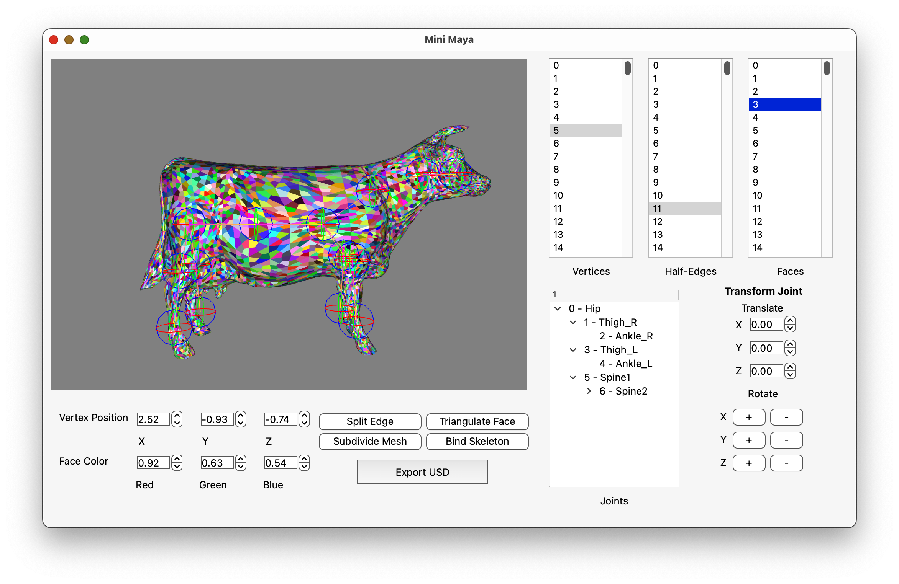

# Mini Maya Mesh Editor

A mesh editor GUI that performs Catmull-Clark subdivision on input OBJ files, binds model skeletons for transformation, and exports out to USD.

### Requirements

- [CMake](https://cmake.org/)
- A local build of [USD](https://github.com/PixarAnimationStudios/OpenUSD.git)
- [Qt6](https://www.qt.io/product/qt6)
- Python ~3.9

### Build Instructions

Locate the helper script `./ez_build.sh` found at the root of this repository.

Replace `cmake_install_prefix` with the repository path.

Replace the `-DUSD_ROOT` CMake flag with the path to your USD build.

Run `./ez_build.sh`, followed by `./ez_run.sh` (or alternatively just locate the executable within your build).